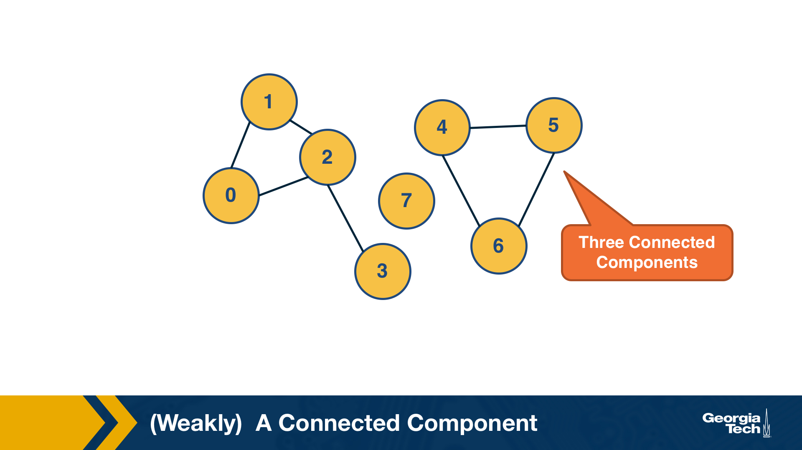
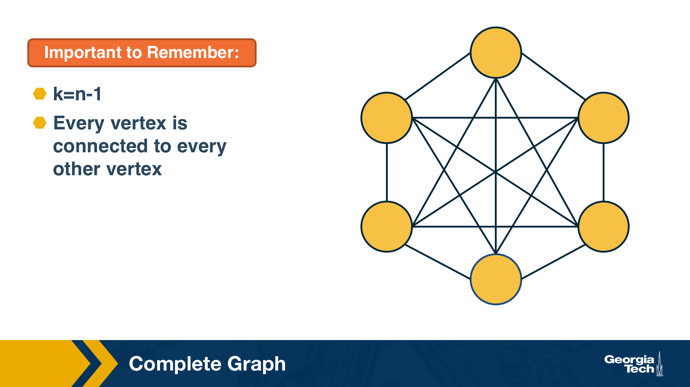
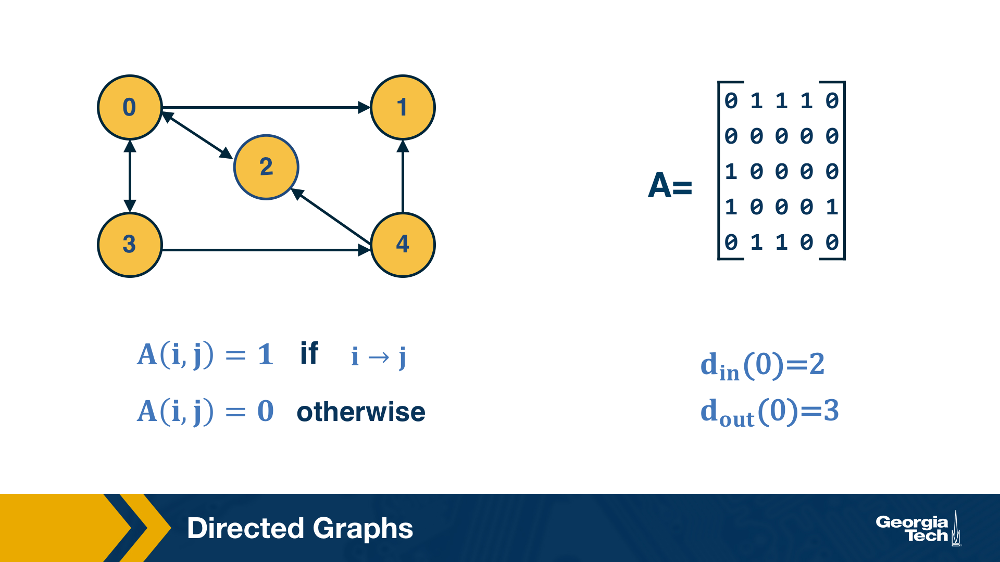

# Module 1 Lesson 02 - Relevant Concepts from Graph Theory

## An Introduction

This visualization shows the seven bridges of Königsberg. The birth of graph theory took place in 1736 when Leonhard Euler showed that it is not possible to walk through all seven bridges by crossing each of them once and only once. 

**Food for Thought**
- Try to model this problem with a graph in which each bridge is represented by an edge, and the landmass at each end of a bridge is represented by a node. The graph should have four nodes (upper, lower, the island in the middle, and the landmass at the right) and seven edges. What is the property of this graph that does not allow to walk through each edge once and only once? 
- You can start from any node you want, and end at any node you want. It is ok to visit the same node multiple times but you should cross each edge only once (this is referred to as a Eulerian path in graph theory).

## Undirected Graphs

Let’s start by defining more precisely what we mean by graph or network -- we use these two terms interchangeably. We will also define some common types of graphs.

A graph, or network, represents a collection of dyadic relations between a set of **nodes**. This set is often denoted by V because nodes are also called **vertices**.  The relations are referred to as **edges** or **links**, usually denoted by the set E. So, an edge (u,v) is a member of the set E, and it represents a relation between vertices u and v in the set V. 

The number of vertices is often denoted by n and the number of edges by m. We will often use the notation **G=(V,E)** to refer to a graph with a set of vertices V and a set of edges E. This definition refers to the simplest type of graph, namely undirected and unweighted. 

Typically we do not allow edges between a node and itself. We also do not allow multiple edges between the same pair of nodes. So the maximum number of edges in an undirected graph is  – or “n-choose-2”.  The **density** of a graph is defined as the ratio of the number of edges m by the maximum number of edges (n-choose-2). The number of connections of a node v is referred to as the **degree** of v. The example above illustrates these definitions. 

## Adjacency Matrix

A graph is often represented either with an Adjacency Matrix, as shown in this visualization. The matrix representation requires a single memory access to check if an edge exists but it requires n2 space. The adjacency matrix representation allows us to use tools from linear algebra to study graph properties.

For example, an undirected graph is represented by a symmetric matrix A – and so the eigenvalues of A are a set of real numbers (referred to as the “spectrum” of the graph). The equation at the right of the visualization reminds you the definition of eigenvalues and eigenvectors.

**Food for Thought**
- How would you show mathematically that the largest eigenvalue of the (symmetric) adjacency matrix A is less or equal than the maximum node degree in the network? Start from the definition of eigenvalues given above.

## Adjacency List

The adjacency list representation requires n+2\*m space because every edge is included twice. 

The difference between adjacency matrices and lists can be very large when the graph is sparse. A graph is sparse if the number of edges m is much closer to the number of nodes n than to the maximum number of edges (n-choose-2). In other words, the adjacency matrix of a sparse graph is mostly zeros. 

A graph is referred to as **dense**, on the other hand, if the number of edges is much closer to n-choose-2 than to n.  

It should be noted that most real-world networks are **sparse**. The reason may be that in most technological, biological and social networks, there is a cost associated with each edge – dense networks would be more costly to construct and maintain.

**Food for Thought**
- Suppose that a network grows by one node in each time unit. The new node always connects to k existing nodes, where k is a constant. As this network grows, will it gradually become sparse or dense (when n becomes much larger than k)?

## Walks, Paths and Cycles

**How can we efficiently count the number of walks of length k between nodes s and t?**
- Please think about this before you look at the answer below.

**Answer**

The number of walks of length k between nodes s and t is given by the element (s,t) of the matrix Ak (the k’th power of the adjacency matrix). 

Let us use induction to show this:

For k=1, the number of walks is either 1 or 0, depending on whether two nodes are directly connected or not, respectively. 

For k>1, the number of walks of length k between s and t is the number of walks of length k-1 between s and v, across all nodes v that connect directly with t. The number of walks of length k between s and v is given by the (s,v) element of the matrix Ak (based on the inductive hypothesis). So, the number of walks of length k between s to t is given by: 

## (Weakly) Connected Components

An undirected graph is connected if there is a path from any node to any other node. As we saw in Lesson-1, there are many real-world networks that are not connected – instead, they consist of more than one **connected components**. 

A **breadth-first-search** (BFS) traversal from a node s can produce the set of nodes in the connected component that includes s. Starting from any other node in that component would result in the same **connected component**. 

If we want to compute the set of all connected components of a graph, we can repeat this BFS process starting each time from a node s that does not belong to any previously discovered connected component. The running-time complexity of this algorithm is 𝝝(m+n) time because this is also the running-time of BFS if we represent the graph with an adjacency list.

Food-for-thought: If you are not familiar with the  notation, please read about them at: [https://en.wikipedia.org/wiki/Big_O_notation](https://en.wikipedia.org/wiki/Big_O_notation) 

## Trees and Other Regular Networks

In graph theory, the focus is often on some special classes of networks, such as trees, lattices, regular networks, planar graphs, etc. 

In this course, we will focus instead on complex graphs that do not fit in any of these special classes. However, we will sometimes contrast and compare the properties of complex networks with some regular graphs.

For instance, trees are connected graphs that do not have cycles – and you can easily show that the number of edges in a tree of n nodes is always m=n-1. 

A k-regular graph is a network in which every vertex has the same degree k. The visualization shows an example of a k-regular network for k=4.

A complete graph (or “clique”) is a special case of a regular network in which every vertex is connected to every other vertex (k=n-1). The example shows a clique with 6 nodes.

**Food for Thought**
- Suppose that a graph is k-regular. How would you show that a vector of n ones (1, 1, … 1) is an eigenvector of the adjacency matrix -- and the corresponding eigenvalue is equal to k?

## Directed Graphs

Another common class of networks is directed graphs. Here, each edge (u,v) has a starting node u and an ending node v. This means that the corresponding adjacency matrix may no longer be symmetric. 

A common convention is that the element (i,j) of the adjacency matrix is equal to 1 if the edge is from node i to node j – please be aware however that this convention is not universal.

We also need to revise our definition of node degree: the number of incoming connections to a node v is referred to as **in-degree** of v, and the number of outgoing connections as **out-degree** of v. 

**Food for Thought**
- Do you see that the sum of in-degrees across all nodes v is equal to the number of edges m? The same is true for the sum of out-degrees.

