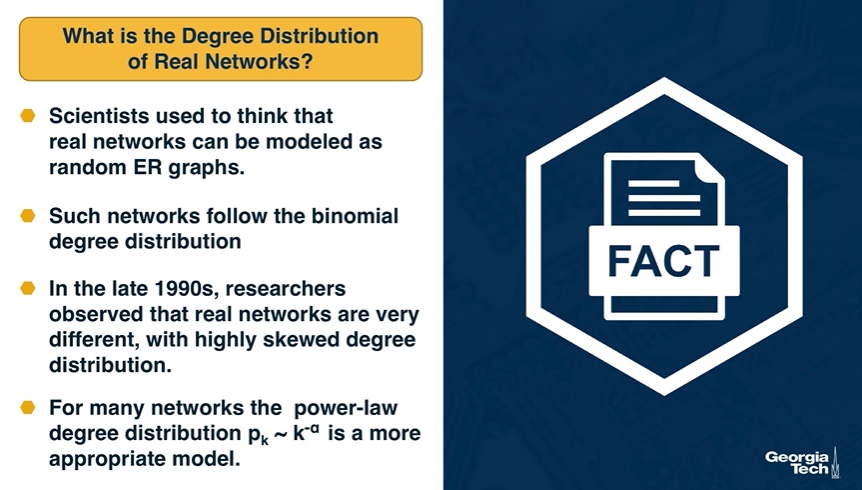
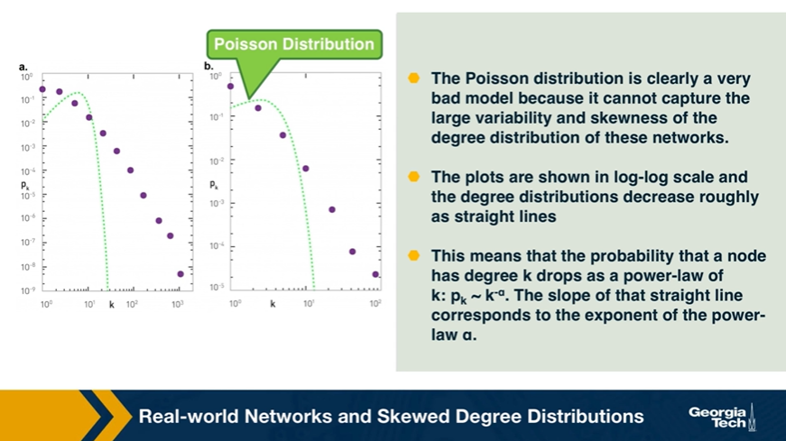
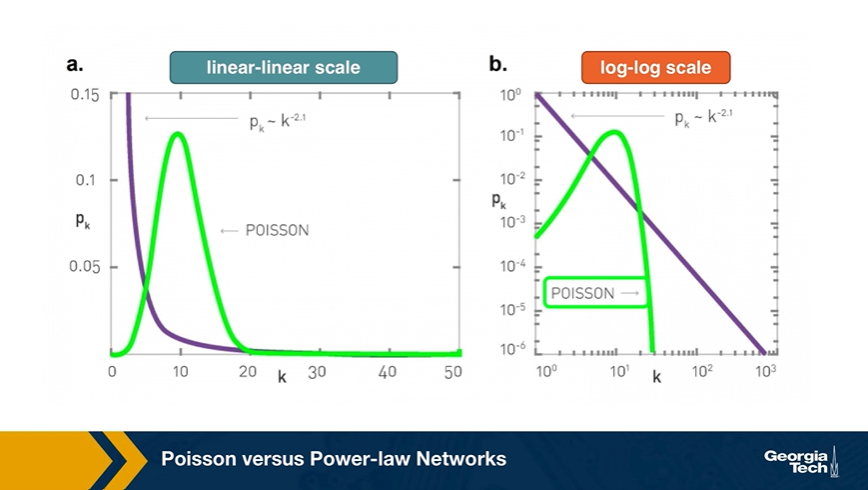
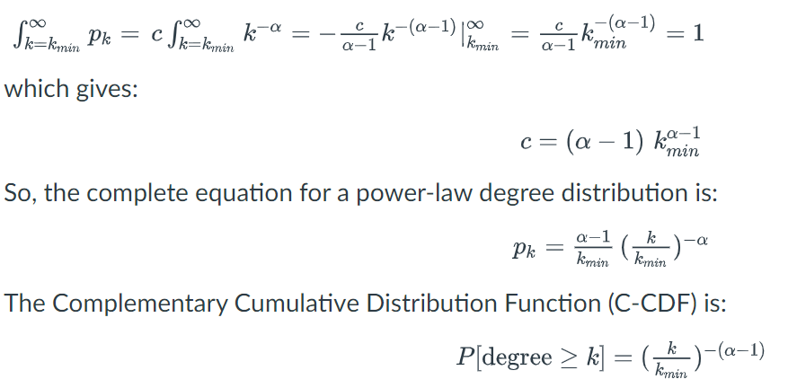
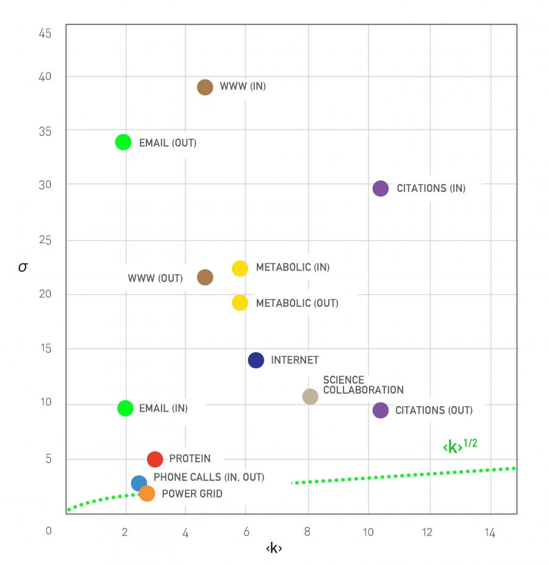

# Module 2 Lesson 04 - Random vs. Real Graphs and Power-Law Networks

## Learning Objectives

Students will be able to:
- See examples of real networks with highly skewed degree distributions
- Understand the math of power-law distributions and the concept of “scale-free” networks
- Learn about models that can generate networks with power-law degree distribution
- Explain the practical significance of power-law degree distributions through case studies

## Degree Distribution of Real Networks

## Power-law Degree Distribution

A “power-law network” has a degree distribution that is defined by the following equation:
p_k = c * k^(-α)

In other words, the probability that the degree of a node is equal to a positive integer k is proportional to k^(-α) where α >0.

The proportionality coefficient c is calculated so that the sum of all degree probabilities is equal to one for a given α and a given minimum degree k_min (the minimum degree may not always be 1). 

The calculation of c can be simplified if we approximate the discrete degree distribution with a continuous distribution:

Note that the exponent of the CCDF function is α - 1, instead of α. So, if the probability that a node has degree k decays with a power-law exponent of 3, the probability that we see nodes with degree greater than k decays with an exponent of 2.

For directed networks, we can have that the in-degree or the out-degree or both follow a power-law distribution (with potentially different exponents).

**Food for Thought**
- **Prompt 1:** Repeat the derivations given here in more detail. 
- **Prompt 2:** Can you think of a network with n nodes in which all nodes have about the same in-degree but the out-degrees are highly skewed?​

## The Role of the Exponent of a Power-law Distribution 
What is the mean and the variance of a power-law degree distribution?

More generally we can ask: what is the m’th statistical moment of a power-law degree distribution?

It is defined as:

where c is the proportionality coefficient we derived in the previous page. 

If we rely again on the continuous k approximation, the previous summation becomes an integral that we can easily calculate:

Note that this integral diverges to infinity if m - α + 1 >= 0 and so, the m’th moment of a power-law degree distribution is well defined (finite) if m < α - 1. 

Consequently, the mean (first moment) exists if α > 2 and the variance (second moment minus the square of the mean) exists if α > 3.  

Of course the variance cannot be “infinite” if the network has a finite number of nodes (i.e., k never ”extends to infinity” in real networks). For many real-world networks however, the exponent α is estimated to be between 2 and 3, which means that even though the distribution has a well-defined average degree, the variability of the degree across different nodes is extremely large.

*Standard Deviation is Large in Real Networks, Figure 4.8 from networksciencebook.com by Albert-László Barabási*

To illustrate this last point, let’s look at the relation between the average degree and the standard deviation of the degreek_istribution for several real-networks (for more details about these networks please review Table 4.1 of your textbook). 

Note that many real-world networks have much higher σ than that --  in some cases σ is even an order of magnitude larger than k_. In the case of the WWW in-degree distribution, for example, the average in-degree is only around 4 while the standard deviation of the in-degree is almost 40!

**Food for Thought**
- Prompt: repeat the derivation for the m’th moment outlined above in more detail. 

## How to Check if a Network Has Power-law Degree Distribution

*Rescaling the Degree Distribution, Figure 4.23 from networksciencebook.com by Albert-László Barabási*

In practice, the degree distribution may not follow an ideal power-law distribution throughout the entire range of degrees. In other words, the empirical degree distribution may not be a perfect straight-line when plotted in log-log scale. Instead, it may look similar to the left plot at this page. There are two important points about this distribution:

- a) For lower values of k, we observe a “low-degree saturation” that **decreases the probability of seeing low-degree nodes** compared to an ideal power-law. If this saturation effect takes place mostly for nodes with degree less than k_sat, we can capture  this effect by considering a modified power-law expression: (k + k_sat)^(-α) Do you see why adding the term k_sat causes a decrease in the probability of low-degree nodes (but it has a minor effect on high-degree nodes)? 
- b) For very high values of k there is again a deviation from the ideal power-law form. The reason is that in practice there are always some “structural” effects that **limit the maximum degree** that a node can have. For example, in a router-level computer network, the maximum degree is limited by the maximum number of interfaces that a router can have due to hardware or cost constraints. To capture such a high-degree cutoff point, we often need to constrain the upper-tail of the degree distribution up to a value k_cut. This value is determined by practical connectivity constraints for the network we analyze. 

In summary, when we want to check if a network follows a power-law degree distribution, we  need to consider whether that distribution drops almost linearly with k in a range between k_sat and k_cut. 

Another approach, that addresses the low-degree saturation effect, is to “rescale” the distribution so that we examine the behavior of the degree probability with (k +k_sat) (instead of k) – still considering the range up to k_cut. This rescaling approach is shown at the plot at the right. 

**Food for Thought**
A more rigorous statistical approach to examine if a network has a power-law degree distribution is described at the following site: [Power-law Distributions in Empirical Data](https://aaronclauset.github.io/powerlaws/). You will experiment with this (or similar) method in an assignment. For now, you may just want to read the description of that method from the given URL. 

